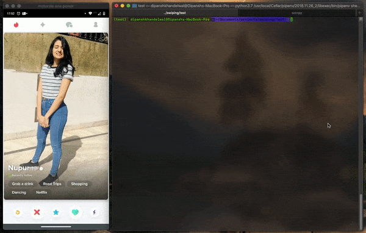
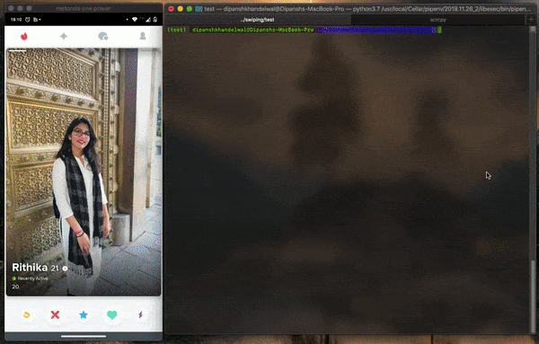

# dev_swiper

Stronger swiping game for devs

Works for almost all dating apps :/

PS : Works only with adb

## Installation

```sh
 pip install dev-swiper
```

## Steps to use

[`Make sure you have adb installed.`](https://developer.android.com/studio/command-line/adb)

- Install the package.
- Connect your android device to your PC.
- Open the respective app
- Use as you like

```sh
swipe
```

It will swipe `right` for 20 times.



## Arguments

* `-c, --count` : Number of swipes [ Default : 20 ]
* `-d, --direction` : Swipe Direction [ Default : right ]
* `-m` : Manual Mode

### Manual Mode

- In manual mode you can `swipe` using your `keyboard`
  - `right ->` : Swipe right
  - `left  <-` : Swipe left
  - `q`        : Quit



## Author

[Dipansh Khandelwal](https://github.com/DipanshKhandelwal)
